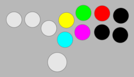
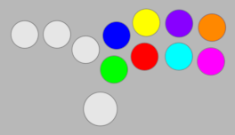

# GP2040 Usage

Select the button labels to be displayed in the usage guide: <label-selector></label-selector>

!> The v0.5 release has some breaking changes to boards other than the RPi Pico. If you are using such a board, do not update from an older version unless you have a backup .uf2 from a known good version, or you know what you're doing.

## Buttons

GP2040-CE uses generic button labeling for gamepad state, which is then converted to the appropriate input type before sending. This table provides a map of GP2040-CE buttons to the supported input types and layouts:

| GP2040-CE  | XInput | Switch  | PS4          | PS3          | DirectInput  | Arcade |
| ---------- | ------ | ------- | ------------ | ------------ | ------------ | ------ |
| B1         | A      | B       | Cross        | Cross        | 2            | K1     |
| B2         | B      | A       | Circle       | Circle       | 3            | K2     |
| B3         | X      | Y       | Square       | Square       | 1            | P1     |
| B4         | Y      | X       | Triangle     | Triangle     | 4            | P2     |
| L1         | LB     | L       | L1           | L1           | 5            | P4     |
| R1         | RB     | R       | R1           | R1           | 6            | P3     |
| L2         | LT     | ZL      | L2           | L2           | 7            | K4     |
| R2         | RT     | ZR      | R2           | R2           | 8            | K3     |
| S1         | Back   | Minus   | Share        | Select       | 9            | Coin   |
| S2         | Start  | Plus    | Options      | Start        | 10           | Start  |
| L3         | LS     | LS      | L3           | L3           | 11           | LS     |
| R3         | RS     | RS      | R3           | R3           | 12           | RS     |
| A1         | Guide  | Home    | PS           | PS           | 13           | Home   |
| A2         | -      | Capture | Touchpad     | -            | 14           | -      |

If you do not have a dedicated Home button, you can activate it via the <hotkey v-bind:buttons='["S1", "S2", "Up"]'></hotkey> button combination.

Unlike other controllers, Keyboard gets different keys for directional buttons.

| Direction | Keyboard   |
| --------- | ---------- |
| Up        | Up Arrow   |
| Down      | Down Arrow |
| Left      | Left Arrow |
| Right     | Right Arrow|

?> You can change the key mappings for Keyboard mode in [Webconfig mode](web-configurator.md)

## Additional Features: Turbo & LS/RS Emulation

Please note that the documentation for these new features is yet to be written. A future version will include updated docs.

## Bootsel Mode

To boot into Bootsel mode (to flash your controller for example), hold the <hotkey v-bind:buttons='["S1", "S2", "Up"]'></hotkey> button combination then plug in your controller.

## Webconfig Mode

To boot into [Webconfig mode](web-configurator.md) (to access the web configurator), hold the <hotkey v-bind:buttons='["S2"]'></hotkey> button combination then plug in your controller.

## Input Modes

To change the input mode, **hold one of the following buttons as the controller is plugged in:**

* <hotkey v-bind:buttons='["B1"]'></hotkey> for Nintendo Switch
* <hotkey v-bind:buttons='["B2"]'></hotkey> for XInput
* <hotkey v-bind:buttons='["B3"]'></hotkey> for DirectInput/PS3
* <hotkey v-bind:buttons='["B4"]'></hotkey> for PS4
* <hotkey v-bind:buttons='["R2"]'></hotkey> for Keyboard

Input mode is saved across power cycles.

## D-Pad Modes

You can switch between the 3 modes for the D-Pad **while the controller is in use by pressing one of the following combinations:**

* <hotkey v-bind:buttons='["S1", "S2", "Down"]'></hotkey> - D-Pad
* <hotkey v-bind:buttons='["S1", "S2", "Left"]'></hotkey> - Emulate Left Analog stick
* <hotkey v-bind:buttons='["S1", "S2", "Right"]'></hotkey> - Emulate Right Analog stick

D-Pad mode is saved across power cycles.

## SOCD Modes

[Simultaneous Opposite Cardinal Direction (SOCD)](https://glossary.infil.net/?t=SOC) cleaning will ensure the controller obeys certain directional input rules when sending inputs to the computer/console. GP2040 users can choose 1 of the 3 SOCD Modes **while the controller is in use by pressing one of the following button combinations:**

* <hotkey v-bind:buttons='["S2", "A1", "Up"]'></hotkey> - **Up Priority mode**: Up + Down = Up, Left + Right = Neutral (Standard stickless behavior).
* <hotkey v-bind:buttons='["S2", "A1", "Down"]'></hotkey> - **Neutral mode**: Up + Down = Neutral, Left + Right = Neutral.
* <hotkey v-bind:buttons='["S2", "A1", "Left"]'></hotkey> - **Last Input Priority (Last Win)**: Hold Up then hold Down = Down, then release and re-press Up = Up. Applies to both axes.

The selected SOCD mode is saved across power cycles.

## Invert D-Pad Y-axis

A toggle is available to invert the Y-axis input of the D-pad, allowing some additional input flexibility. To toggle, press <hotkey v-bind:buttons='["S2", "A1", "Right"]'></hotkey>. This is a temporary hotkey mapping for this feature, so keep an eye on updated releases for this to change.

## RGB LEDs

### RGB LED Animations

The following animations are available:

| Name | Description | LED Parameter |
| - | - | - |
| Off | Turn off per-button RGB LEDs | - |
| Static Color | Sets all LEDs to the same color | Cycle through colors: *Red*, *Orange*, *Yellow*, *Lime Green*, *Green*, *Seafoam*, *Aqua*, *Sky Blue*, *Blue*, *Purple*, *Pink*, *Magenta* |
| Rainbow Cycle | All LEDs cycle through the color wheel displaying the same color | Adjust animation speed |
| Rainbow Chase | A fading, rainbow cycling lines travels across the LED chain | Adjust animation speed |
| Static Theme | Set the LEDs to a pre-defined static theme | Cycle through themes, see [RGB LED Static Themes](#rgb-led-static-themes) for details. |

### RGB LED Hotkeys

| Hotkey | Description |
| - | - |
| <hotkey v-bind:buttons='["S1", "S2", "B3"]'></hotkey> | Next Animation |
| <hotkey v-bind:buttons='["S1", "S2", "B1"]'></hotkey> | Previous Animation |
| <hotkey v-bind:buttons='["S1", "S2", "B4"]'></hotkey> | Brightness Up |
| <hotkey v-bind:buttons='["S1", "S2", "B2"]'></hotkey> | Brightness Down |
| <hotkey v-bind:buttons='["S1", "S2", "R1"]'></hotkey> | LED Parameter Up |
| <hotkey v-bind:buttons='["S1", "S2", "R2"]'></hotkey> | LED Parameter Down |
| <hotkey v-bind:buttons='["S1", "S2", "L1"]'></hotkey> | Pressed Parameter Up |
| <hotkey v-bind:buttons='["S1", "S2", "L2"]'></hotkey> | Pressed Parameter Down |

The `LED Parameter` hotkeys may affect color, speed or theme depending on the current RGB LED animation. The `Pressed Parameter` options will change the colors/effects for the on-press animations.

### RGB LED Static Themes

| Name | Preview |
| - | - |
| **Static Rainbow** |  |
| **Xbox** |  |
| **Xbox (All)** |  |
| **Super Famicom** |  |
| **Super Famicom (All)** |  |
| **PlayStation** |  |
| **PlayStation (All)** |  |
| **Neo Geo Straight** |  |
| **Neo Geo Curved** |  |
| **Neo Geo Modern** |  |
| **Six Button Fighter** |  |
| **Six Button Fighter +** |  |
| **Street Fighter 2** |  |
| **Tekken** |  |
| **Guilty Gear Type-A** |  |
| **Guilty Gear Type-B** |  |
| **Guilty Gear Type-C** |  |
| **Guilty Gear Type-D** |  |
| **Guilty Gear Type-E** |  |
| **Fightboard** |  |

## I2C Input Expansion

The input expansion allows a second microcontroller to extend the number of analog and digital
inputs of the main board though I2C. The mapping between the microcontroller data and the actual
inputs is defined by the I2C Input Expansion Add-on.

### Protocol

The data protocol is defined as it follows:

- Each data response from the microcontroller has 16 words.
- Each word is a 2-byte little-endian unsigned integer.
- The first words are the analog values, and the rest are the digital values.
- Each analog value uses exactly one word (0-65535).
- Each digital value uses one bit of a word.
- Each word can fit 16 digital values.

The configuration of the microcontroller is not covered by the protocol and it
is done separately.

### Input Mapping

The input is mapped using the `I2C Input Expansion Analog Map` and
`I2C Input Expansion Digital Map` fields of the I2C Input Expansion Add-on. These are
comma-separated values of the MPG inputs that will be associated with each
word / bit of the response data, in the order as they appear.
Analog inputs are handled first, then the digital inputs.
