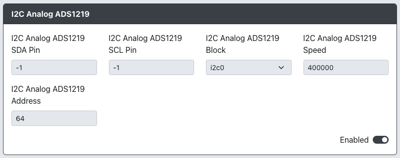
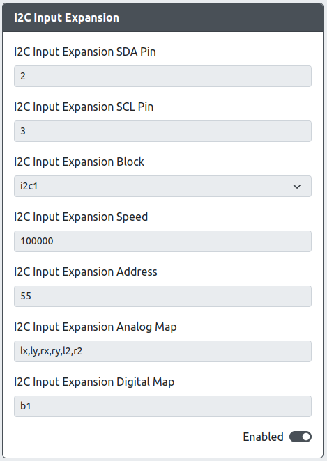

# GP2040 Web Configurator

Select the button labels to be displayed in the web configurator guide: <label-selector></label-selector>

GP2040 contains a built-in web-based configuration application which can be started up by holding <hotkey v-bind:buttons='["S2"]'></hotkey> when plugging your controller into a PC. Then access <http://192.168.7.1> to begin configuration.

## Home

Here you can see the current version of your firmware and the latest version available on Github in the releases section. If a firmware update is available, a link to that release will appear.

The options in the main menu are:

* [Home](#home) - The start page
* [Settings](#settings) - Adjust settings like input mode, d-pad mode, etc.
* [Configuration > Pin Mapping](#pin-mapping) - Allows for remapping of GPIO pins to different buttons.
* [Configuration > LED Configuration](#led-configuration) - Enable and configure RGB LEDs here.
* [Configuration > Display Configuration](#display-configuration) - Enable and configure display options
* [Configuration > Add-Ons Configuration](#add-ons-configuration) - Enable and configure available add-ons
* [Configuration > Data Backup and Restoration](#data-backup-and-restoration) - Backup and restore settings
* Links - Useful links to the project and documentation
* [DANGER ZONE](#danger-zone) - Don't be afraid of the big red button. If something becomes misconfigured, you can reset your settings here.

## Settings

Here you can select the basic settings which are normally available via hotkeys.

## Pin Mapping

Here you can remap the GP2040 buttons to different GPIO pins on the RP2040 chip. This can be used to simply remap buttons, or bypass a GPIO pin that may have issues on your device.

## LED Configuration

If you have a setup with per-button RGB LEDs, they can be configured here.

* `Data Pin` - The GPIO pin that will drive the data line for your RGB LED chain. Set to `-1` to disable RGB LEDs.
* `LED Format` - The data format used to communicate with your RGB LEDs. If unsure the default `GRB` value is usually safe.
* `LED Layout` - Select the layout for your controls/buttons. This is used for static themes and some per-button animations.
* `LEDs Per Button` - Set the number of LEDs in each button on your chain.
* `Max Brightness` - Set the maximum brightness for the LEDs. Ranges from 0-255.
* `Brightness Steps` - The number of levels of brightness to cycle through when turning brightness up and down.
* `LED Button Order` - Configure which buttons and what order they reside on the LED chain.

## Display Configuration

* `Use Display` - Turns on/off the display module.
* `I2C Block` - The Pico I2C block that will be used. Set based on pins, refer to table on page.
* `SDA Pin` - The GPIO pin used for the I2C SDA channel.
* `SCL Pin` - The GPIO pin used for the I2C SCL channel.
* `I2C Address` - The I2C address of your device, defaults to the very commonly used `0x3C`
* `I2C Speed` - Sets the speed of I2C communication. Common values are `100000` for standard, `400000` for fast and `800000` ludicrous speed.
* `Flip Display` - Rotates the display 180°.
* `Invert Display` - Inverts the pixel colors, effectively giving you a negative image when enabled.
* `Button Layout (Left)` - Changes the onscreen layout for the left side of the display and stick.
* `Button Layout (Right)` - Changes the onscreen layout for the right side of the display and stick.
* `Splash Mode` - Enables or disables a splash screen displaying when the unit is turned on.
* `Splash Choice` - Choose the splash screen that is displayed when the unit is turned on.

Check out our collection of great custom splash screens from the community [HERE](community-splash-screens.md)

## Add-Ons Configuration

This section is for custom add-ons that can be enabled to exand the functionality of GP2040-CE.  Please not that not all add-ons may work together.  These should be considered experminental.

Turbo

* `Turbo Pin` - The GPIO pin used for the Turbo button.
* `Turbo Pin LED` - The GPIO pin used for the Turbo LED.
* `Turbo Shot Count` - The number of of presses per second that the Turbo will activate at.

Joystick Selection Slider

* `Slider LS Pin` - The GPIO pin used to activate the Left Stick while held.
* `Slider RS Pin` - The GPIO pin used to activate the Right Stick while held.

Input Reverse

* `Reverse Input Pin` - The GPIO pin used for the Reverse Input button.
* `Reverse Input Pin LED` - The GPIO pin used for the Reverse Input LED.
* `Reverse Up` - Enables the up direction to be reversed when the Reverse Input button is pressed or held.
* `Reverse Down` - Enables the down direction to be reversed when the Reverse Input button is pressed or held.
* `Reverse Left` - Enables the left direction to be reversed when the Reverse Input button is pressed or held.
* `Reverse Right` - Enables the right direction to be reversed when the Reverse Input button is pressed or held.

I2C Analog ADS1219

* `I2C Analog ADS1219 SDA Pin` - The GPIO pin used for I2C Analog ADS1219 SDA.
* `I2C Analog ADS1219 SCL Pin` - The GPIO pin used for I2C Analog ADS1219 SCL.
* `I2C Analog ADS1219 Block` - The block of I2C to use (i2c0 or i2c1).
* `I2C Analog ADS1219 Speed` - Sets the speed of I2C communication. Common values are `100000` for standard, `400000` for fast and `800000` ludicrous speed.
* `I2C Analog ADS1219 Address` - Sets the address for the I2C Analog ADS1219.

I2C Input Expansion

* `I2C Input Expansion SDA Pin` - The GPIO pin used for I2C Input Expansion SDA.
* `I2C Input Expansion SCL Pin` - The GPIO pin used for I2C Input Expansion SCL.
* `I2C Input Expansion Block` - The block of I2C to use (i2c0 or i2c1).
* `I2C Input Expansion Speed` - Sets the speed of I2C communication. The standard value of `100000`
should work for most hardware.
* `I2C Input Expansion Address` - The I2C address of the I2C Input Expansion.
* `I2C Input Expansion Analog Map` - Comma-separated list of analog inputs published by the I2C Input Expansion.
* `I2C Input Expansion Digital Map` - Comma-separated list of digital inputs published by the I2C Input Expansion.

Buzzer Speaker

* `Use buzzer` - Turns on/off the buzzer module.
* `Buzzer Pin` - The GPIO pin used for the buzzer.
* `Buzzer Volume` - Audio volume of buzzer. 0-100.

## Data Backup and Restoration

* `Backup To File` - Allows you to select what to backup to a file (default is all selected).
* `Restore From File` - Allows you to select what to restore from a file (default is all selected).

## DANGER ZONE

